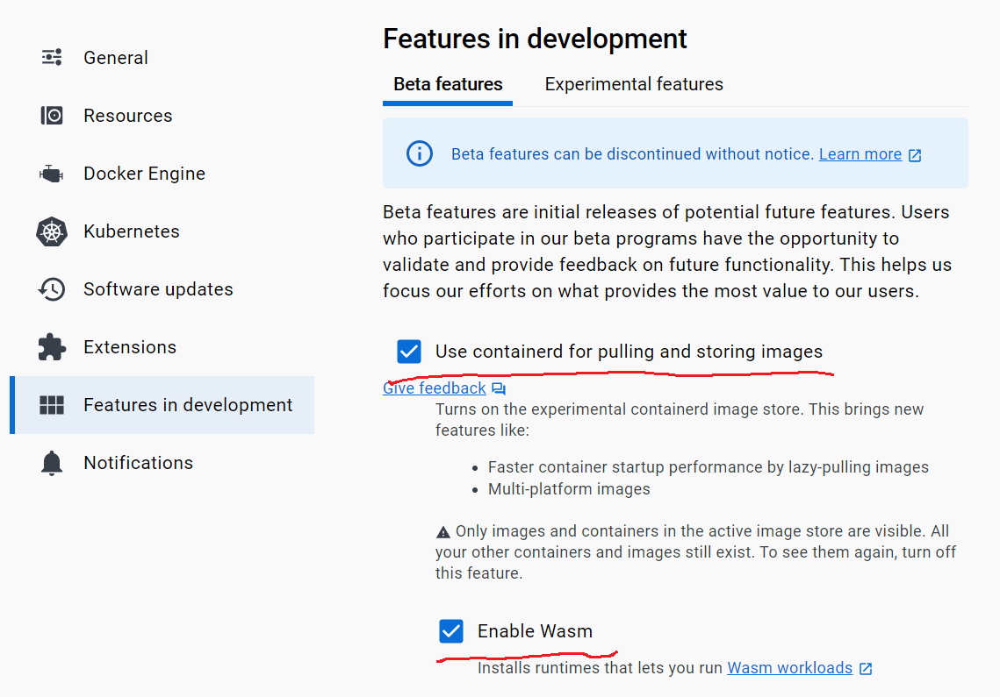

# hello-wasm-api

## 目的
- webAPIとして振る舞うコードをwasmファイル化する
- wasmファイルをdockerコンテナとして実行できるようにする
- このコンテナをAWS AppRunnerから実行できるようにする
- https://devops-blog.virtualtech.jp/entry/20230907/1694054879

## Rustコード -> wasmファイルのbuild
- Rustコードをビルドしてwasmファイルを得るには以下のコマンドを実行する
- javascriptとのインタラクションは不要なのでwasm-bindgenは使わない
- wasmファイルはwasmtime等のWebAssembly実行環境で実行することを前提としているため、エントリポイントとしてのmain関数を持たせる

```
cargo build --target wasm32-wasi --release
```

- `target/wasm32-wasi/release/`配下に`.wasm`ファイルが出力される

## wasmtimeによるwasmの実行

```
wasmtime target/wasm32-wasi/release/hello-wasm-api.wasm
```

## wasmファイル -> docker imageのbuild
- デプロイ用のDockerfileと同じディレクトリにwasmファイルをコピー

```
cp target/wasm32-wasi/release/hello-wasm-api.wasm deploy
```

- Dockerfile + wasmファイルからdocker imageを作成

```
docker buildx build --platform wasi/wasm -t zakuro0w0/hello-wasm
```

- scrachでwasmファイルのみから作っているのでimage sizeが僅か2.67MBになった

```
zakuro0w0@surface:~/projects/hello-wasm-api$ docker image ls
REPOSITORY                                                                                TAG       IMAGE ID       CREATED          SIZE
zakuro0w0/hello-wasm                                                                      latest    dc7c52154658   19 minutes ago   2.67MB
```

## DockerDesktopでwasmを実行できるようにする
- https://docs.docker.com/desktop/wasm/?uuid=6DDEC77A-2683-43C0-A0C0-4496CEF99D20#turn-on-wasm-workloads
  - `Enable Wasm`にチェックを入れることでコンテナのランタイムとしてwasmedge, wasmtimeを選択できるようになる



## DockerDesktopでwasmを実行する
- 以下のコマンドでwasmを実行できる

```
docker container run --rm \
  --runtime=io.containerd.wasmtime.v1 \
  --platform=wasi/wasm \
  zakuro0w0/hello-wasm
```